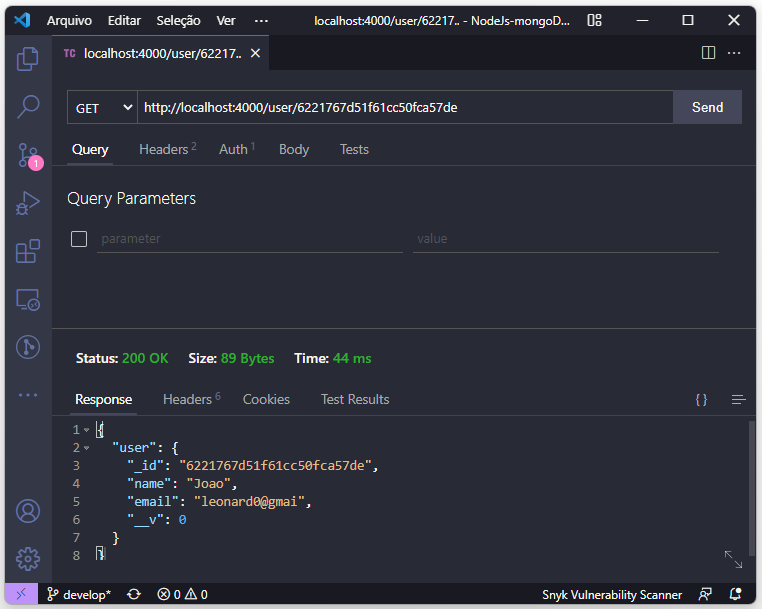

# NodeJs-mongoDB-authentication

Aplicação em NodeJs com Express e MongoDB para estudos de API e autenticação

Utilizando bcrypt para criptografar a senha e jsonwebtoken para autenticar o token

## start

```npm run start ```

### Para rodar o projeto

```npm run start```

## Dica para testes

Para testes locais ultilize a extensão ```Thunder Client```

